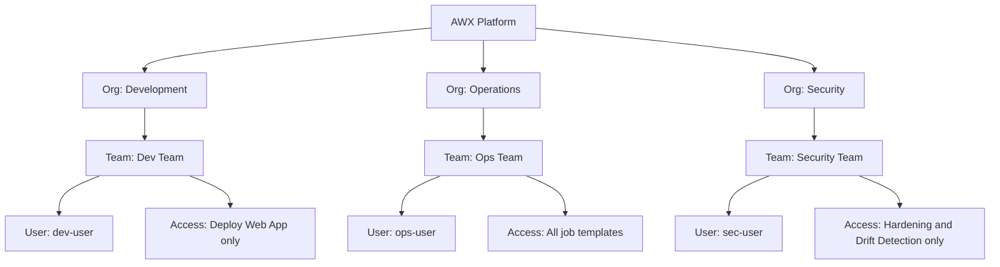
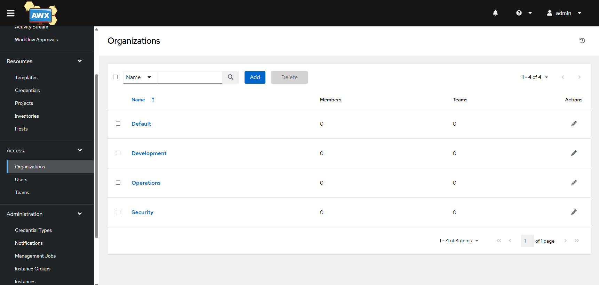
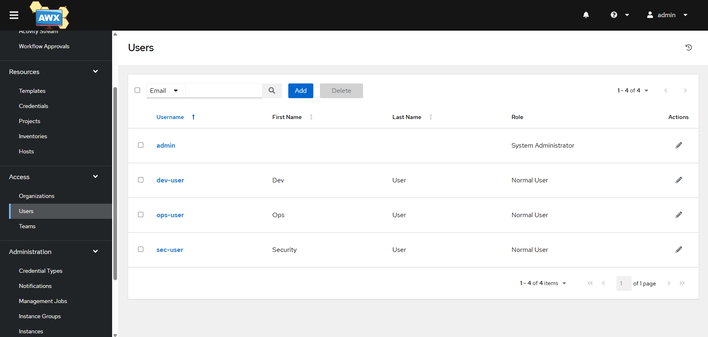
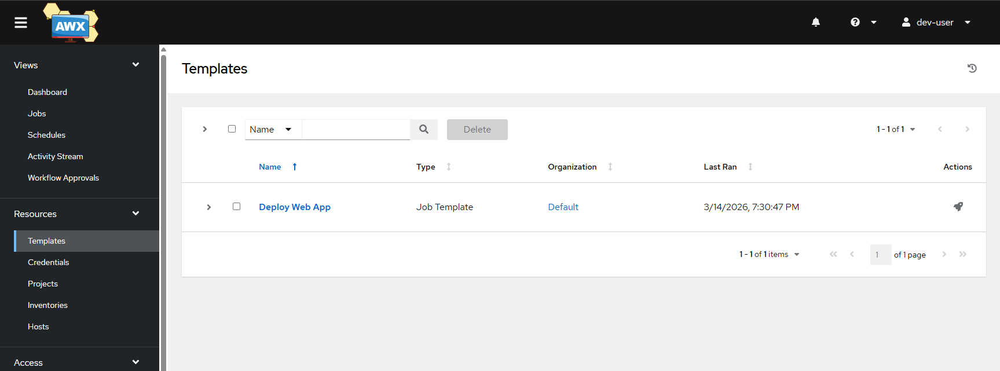
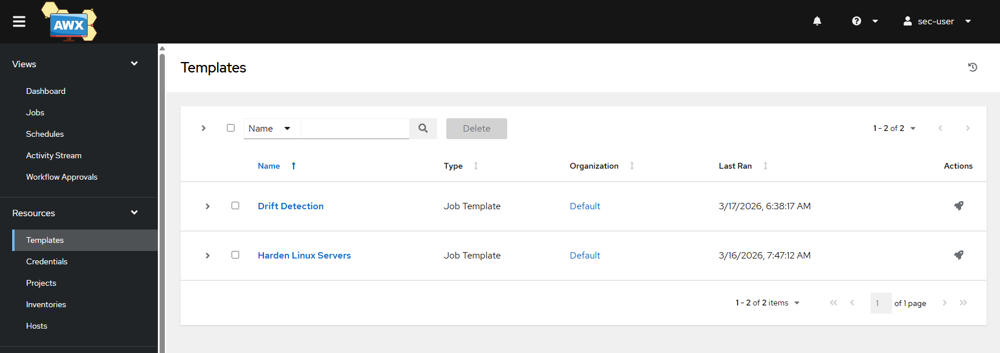
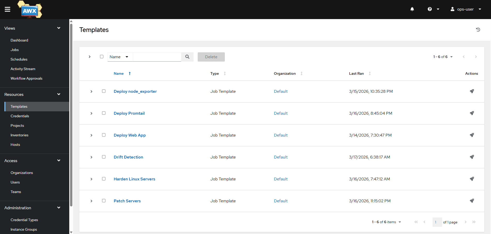

# AWX RBAC + Team Management

Enterprise Role-Based Access Control implementation on AWX (Ansible Automation Platform).
Three organizations with dedicated teams and users demonstrate least-privilege
access control — each team sees only the job templates relevant to their role.

---

## Architecture

---

## RBAC Design

The platform is structured around three organizations representing typical enterprise roles:

- **Development** - allowed to deploy application code only
- **Operations** - full control over infrastructure and automation workflows
- **Security** - execute access to compliance and hardening workflows with no access to application deployment or infrastructure provisioning

Access is enforced using AWX role-based permissions at the job template,
inventory, and credential levels.

This implementation follows the principle of least privilege - users are granted
only the minimum level of access required to perform their role, reducing risk
and enforcing separation of duties.

---

## Access Enforcement Example

A Development user attempting to access infrastructure patching jobs is denied:

- Cannot see Patch Servers template
- Cannot execute drift detection
- No access to production inventory
- No access to SSH credentials

This demonstrates strict separation of duties and least-privilege access.

---

## Access Control Matrix

| Job Template | Dev Team | Ops Team | Security Team |
|-------------|----------|----------|---------------|
| Deploy Web App | Execute | Execute | No access |
| Deploy node_exporter | No access | Execute | No access |
| Deploy Promtail | No access | Execute | No access |
| Harden Linux Servers | No access | Execute | Execute |
| Drift Detection | No access | Execute | Execute |
| Patch Servers | No access | Execute | No access |

---

## Organizations and Teams

| Organization | Team | User | Access Level |
|-------------|------|------|--------------|
| Development | Dev Team | dev-user | Deploy jobs only |
| Operations | Ops Team | ops-user | Full platform access |
| Security | Security Team | sec-user | Hardening and compliance only |

---

## Access Verification

Each user was logged into AWX independently to verify access boundaries:

- dev-user sees only Deploy Web App in the Templates page
- sec-user sees only Harden Linux Servers and Drift Detection
- ops-user sees all job templates across all projects

This demonstrates that AWX RBAC enforces least-privilege access at the
job template level - users cannot see or execute jobs outside their role.

---

## Screenshots

### AWX Organizations

### AWX Users

### dev-user Templates View

### sec-user Templates View

### ops-user Templates View

---

## DevOps Skills Demonstrated

- AWX RBAC configuration (organizations, teams, users, roles)
- Least-privilege access control implementation
- Multi-tenant automation platform management
- Role separation between Dev, Ops, and Security teams
- AWX Execute and Use role assignment
- Platform engineering and access governance
- Separation of duties enforcement

---

## Part of DevOps Portfolio

- [Project 1 - Enterprise Infrastructure Automation Lab](https://github.com/proclaudio/enterprise-infrastructure-automation-lab)
- [Project 2 - CI/CD Push-to-Deploy Pipeline](https://github.com/proclaudio/cicd-push-to-deploy-pipeline)
- [Project 3 - Infrastructure Monitoring Stack](https://github.com/proclaudio/infrastructure-monitoring-stack)
- [Project 4 - Automated Security Hardening](https://github.com/proclaudio/automated-security-hardening)
- [Project 5 - Centralized Log Management](https://github.com/proclaudio/centralized-log-management)
- [Project 6 - Patch Management + Drift Detection](https://github.com/proclaudio/patch-management-drift-detection)
- **Project 7 - AWX RBAC + Team Management** (this repo)
- Project 8 - Kubernetes Platform Lab (coming soon)
